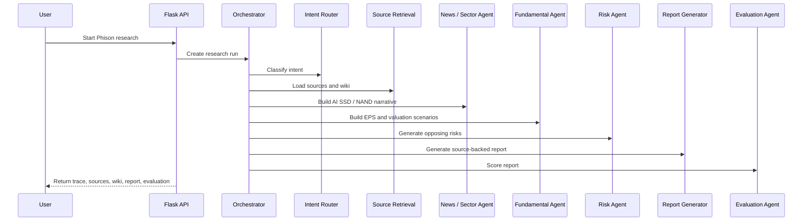
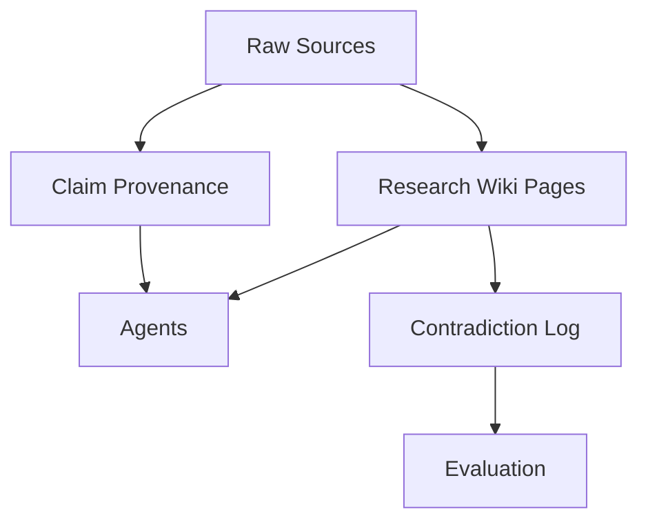

# Architecture

## System Context

```mermaid
flowchart LR
  User["使用者"] --> Vue["Vue Web App"]
  Vue --> Flask["Flask API"]
  Flask --> Orchestrator["Research Orchestrator"]
  Orchestrator --> Agents["Deterministic Agents"]
  Orchestrator --> Wiki["LLMWiki-lite"]
  Orchestrator --> Fixtures["Local JSON / Markdown Fixtures"]
  Agents --> Report["Research Report"]
  Agents --> Eval["Evaluation"]
```

## Agent Workflow

```mermaid
sequenceDiagram
  participant U as User
  participant API as Flask API
  participant O as Orchestrator
  participant R as Intent Router
  participant S as Source Retrieval
  participant N as News / Sector Agent
  participant F as Fundamental Agent
  participant K as Risk Agent
  participant G as Report Generator
  participant E as Evaluation Agent

  U->>API: Start Phison research
  API->>O: Create research run
  O->>R: Classify intent
  O->>S: Load sources and wiki
  O->>N: Build AI SSD / NAND narrative
  O->>F: Build EPS and valuation scenarios
  O->>K: Generate opposing risks
  O->>G: Generate source-backed report
  O->>E: Score report
  API-->>U: Return trace, sources, wiki, report, evaluation
```

## LLMWiki-lite

```mermaid
flowchart TB
  Sources["Raw Sources"] --> WikiPages["Research Wiki Pages"]
  Sources --> Provenance["Claim Provenance"]
  WikiPages --> Agents["Agents"]
  Provenance --> Agents
  WikiPages --> Audit["Contradiction Log"]
  Audit --> Evaluation["Evaluation"]
```

## Local-First Boundary

第一版不依賴 Supabase、真實 LLM、即時行情 API 或 crawler。這讓課程抽查時即使外部服務不可用，也能展示主要 happy path。
