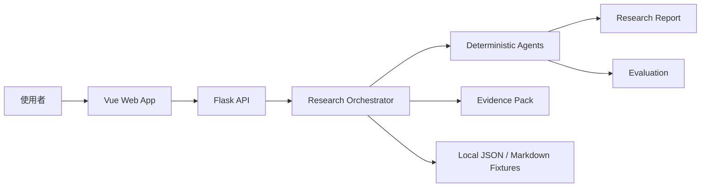
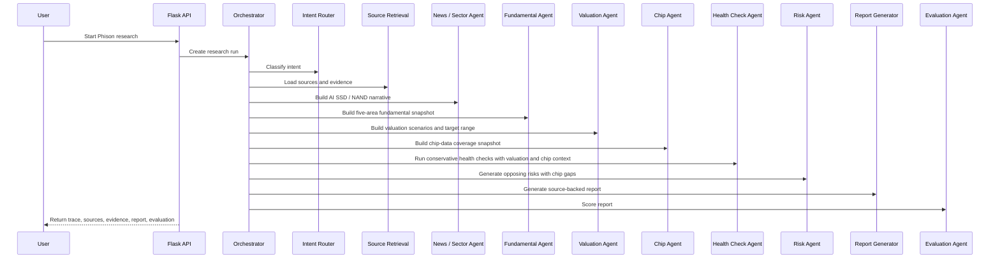
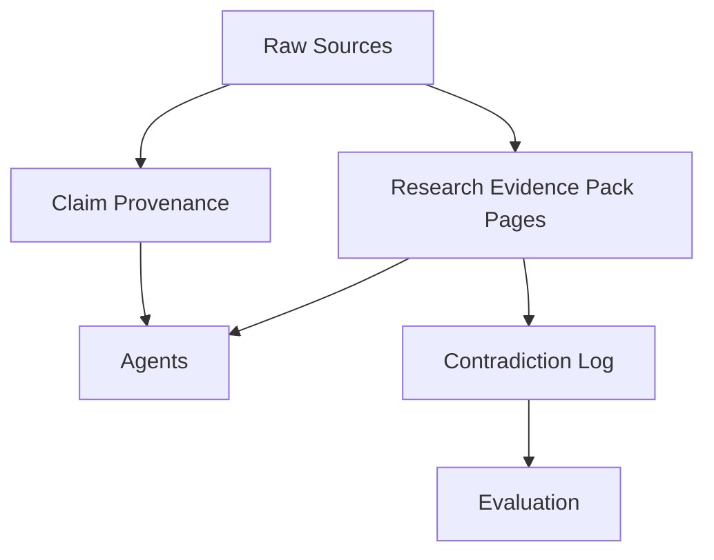

# Architecture

## System Context

## Agent Workflow

Chip Agent 第一版只讀 `data/phison/chip_fixture.json`，不登入財報狗、不接券商分點或即時籌碼 API。它輸出 `analysis.chip`，讓 UI、報告、Health Check Agent 與 Evaluation Agent 都能看到籌碼資料缺口；Health Check Agent 只消費這個 output，不重新計算籌碼 metrics。

## Evidence Pack

## Local-First Boundary

第一版不依賴 Supabase、真實 LLM、即時行情 API 或 crawler。這讓課程抽查時即使外部服務不可用，也能展示主要 happy path。
