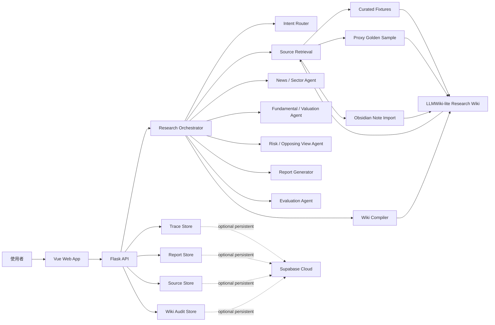
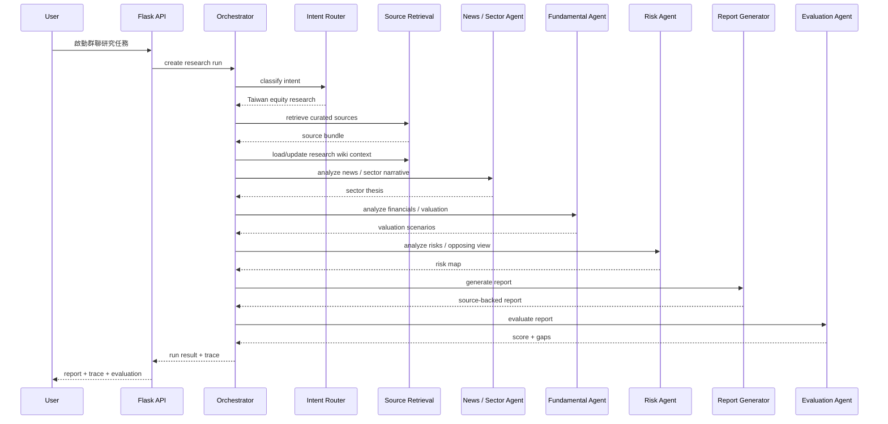

# Design：多代理個人投資 / 理財系統

狀態：草稿 v0.3  
對應 SPEC：`/Users/andrew-ideaslab/Documents/New project/SPEC.md`  
OpenSpec 變更：`personal-finance-multi-agent-system`  

> 這份設計先回答「第一版要怎麼做得出來、看得見、能評估」。它不是最終 implementation plan；確認方向後才進入 `tasks.md`。

## 1. 已決策技術方向

| 面向 | 決策 | 理由 |
|---|---|---|
| 後端 | Flask | Python-first，適合快速串 agent workflow、資料處理、evaluation 與金融資料清洗 |
| 前端 | Vue | 適合做可展示的互動式研究頁、agent trace timeline、source drawer 與 evaluation panel |
| 資料庫 | Supabase Cloud，若第一版需要持久化 | 適合快速建立 Postgres、Auth、Storage 與 API；但不應在第一版過早綁死資料模型 |
| 第一版資料 | 手動 curated fixtures + golden sample + 使用者 Obsidian 筆記 | 降低爬蟲與資料品質風險，先讓 demo 和 evaluation 成立 |
| 第一版資料收集 | 不先自動爬蟲 | Exa API、CMoney/news crawler、MOPS crawler 放到後續版本 |
| 研究知識層 | LLMWiki-lite Markdown wiki | 把 raw sources 轉成可讀、可連結、可追溯、可審計的研究知識 |

### 1.1 已確認第一版 implementation 前提

| 問題 | 決策 |
|---|---|
| Supabase | 第一版先不接，只用本機 fixture / Markdown / JSON；Supabase Cloud 作為後續持久化版本 |
| LLM | 第一版先使用 mock / deterministic agents；等 UI、trace、evaluation 穩定後再接真實 LLM |
| 股價資料 | 第一版用手動 fixture 或使用者輸入展示股價，不接即時行情 API |
| LLMWiki-lite 深度 | 第一版只做群聯 7 個 wiki pages + provenance + contradiction log，不做完整 knowledge graph |

## 2. 設計原則

1. **先展示可驗證研究流程，不先追求資料自動化**
   - 第一版的價值在於：使用者與面試官能看見 agent 如何取資料、如何形成主張、如何被評估。
   - 資料可以先手動整理，只要來源、日期、類型、限制都完整。

2. **先做 deterministic demo，再接真實 LLM / API**
   - 第一版可以讓部分 agent 先用固定 fixture 產出，確保展示穩定。
   - 真實 LLM 代理可以逐步替換 deterministic agent。

3. **trace 是核心產品，不是除錯附屬品**
   - 網頁不能只顯示最後報告。
   - 每個代理步驟都要顯示輸入摘要、輸出摘要、來源、信心、耗時、成本欄位。

4. **不要把公開來源摘要誤稱為券商研報**
   - CMoney、新聞、FactSet、官方財報要分層。
   - proxy golden sample 必須清楚標示不是完整券商研究報告。

5. **Supabase 是持久化層，不是第一個 blocker**
   - 若要保存研究歷史、trace、evaluation 與來源資料，使用 Supabase。
   - 若只是第一版 demo，可先用本機 JSON / Markdown fixture 讓流程跑通。

6. **研究 Wiki 讓知識累積，而不是每次從零開始 RAG**
   - Raw sources 保持不可變。
   - Wiki pages 由 agent 建議更新，但高風險結論需人工 review。
   - 每個重要 claim 都要能追溯來源、日期與內容版本。

## 3. 系統架構



## 4. 前端設計

### 4.1 第一版頁面

第一版只需要一個主要研究工作台，不做 landing page。

主要區塊：

1. **研究任務列**
   - 預設標的：群聯電子（8299）
   - 預設問題：人工智慧固態硬碟成長故事是否足以支撐目前估值？
   - 啟動研究按鈕

2. **Agent Trace Timeline**
   - 顯示每個代理步驟的狀態：等待、執行中、完成、低信心、失敗。
   - 每個步驟可點開查看摘要與來源。

3. **Source Panel**
   - 顯示來源清單：官方資料、新聞、CMoney、FactSet、Obsidian、golden sample。
   - 每筆來源顯示日期、URL / path、來源類型、可信度限制。

4. **Research Report**
   - 顯示最後產出的研究摘要。
   - 重要主張要能連回來源與 agent step。

5. **Evaluation Panel**
   - 顯示總分、各項 rubric 分數、未通過原因。
   - 若低於 4.0 / 5，標示低信心或需要補資料。

6. **Research Wiki Panel**
   - 顯示目前已整理出的 wiki pages。
   - 顯示 claim provenance、contradiction log、stale claim 提醒。
   - 第一版可以只讀不改，讓使用者看見知識如何被整理。

### 4.2 前端暫定元件

| 元件 | 用途 |
|---|---|
| `ResearchRunView` | 單次研究任務主頁 |
| `ResearchQuestionBar` | 標的與問題輸入 / 預設任務 |
| `AgentTimeline` | 代理執行軌跡 |
| `AgentStepDrawer` | 單一 agent step 詳細資料 |
| `SourceList` | 來源清單與可信度標示 |
| `ReportViewer` | 報告顯示與 claim-source linking |
| `EvaluationPanel` | 分數、rubric、修正建議 |
| `WikiPageViewer` | 顯示 LLMWiki-lite 研究頁與 provenance |
| `ContradictionLog` | 顯示矛盾、過期 claim 與待 review 更新 |

## 5. 後端設計

### 5.1 Flask API 邊界

第一版 Flask 後端負責：

- 接收研究問題。
- 啟動研究 orchestrator。
- 回傳 agent trace、來源、報告、evaluation。
- 讀取 curated fixtures、golden sample 與 Obsidian 筆記。
- 若啟用 Supabase，保存研究 run 與 trace。

暫定 API：

| Method | Path | 用途 |
|---|---|---|
| `GET` | `/api/health` | 健康檢查 |
| `GET` | `/api/demo/default-run` | 取得預設群聯 demo run |
| `POST` | `/api/research-runs` | 建立並執行研究任務 |
| `GET` | `/api/research-runs/{run_id}` | 取得單次研究結果 |
| `GET` | `/api/research-runs/{run_id}/steps` | 取得 agent trace |
| `GET` | `/api/research-runs/{run_id}/sources` | 取得來源清單 |
| `GET` | `/api/research-runs/{run_id}/evaluation` | 取得評估結果 |

第一版可以先採同步 API，因為資料量與 demo 流程可控。若要展示「執行中」狀態，再加入 server-sent events 或 polling。

### 5.2 後端模組

| 模組 | 責任 |
|---|---|
| `app.py` / Flask app factory | 啟動 API、設定 CORS、註冊 routes |
| `routes/research_runs.py` | 研究任務 API |
| `orchestrator/research_orchestrator.py` | 控制 agent 執行順序、trace、error handling |
| `agents/intent_router.py` | 判斷是否為台股研究、是否需要完整流程 |
| `agents/source_retrieval.py` | 從 fixture / golden sample / Obsidian 取資料 |
| `agents/news_sector_agent.py` | 整理新聞與產業敘事 |
| `agents/fundamental_agent.py` | 整理財務、EPS、估值情境 |
| `agents/risk_agent.py` | 產生反方觀點與風險 |
| `agents/report_generator.py` | 產生研究報告 |
| `agents/evaluation_agent.py` | 依 rubric 評分 |
| `knowledge/wiki_compiler.py` | 將來源摘要整理成 wiki pages 與更新提案 |
| `knowledge/provenance.py` | 記錄 claim 來源、source hash、stale 狀態 |
| `knowledge/FINANCE_WIKI.md` | 定義 wiki page 格式、引用規則、矛盾判定與 review gate |
| `stores/file_store.py` | 第一版本機 JSON / Markdown 資料讀寫 |
| `stores/supabase_store.py` | Supabase 持久化，若啟用 |

## 6. Agent Workflow



## 7. LLMWiki-lite 研究 Wiki 層

LLMWiki-lite 是本專案的研究知識層。它不是取代 RAG，也不是完整 knowledge graph；它把已整理來源轉成可讀、可連結、可審計的 Markdown pages，讓 agent 不必每次從 raw documents 重新拼答案。

### 7.1 三層設計

| 層級 | 本專案對應 | 是否可修改 | 用途 |
|---|---|---|---|
| Raw sources | 新聞、財報、CMoney、FactSet、官方資料、Obsidian 筆記 | 不可直接修改 | 保留原始依據與來源 hash |
| Research Wiki | 群聯公司頁、AI SSD 頁、NAND 週期頁、估值假設頁、風險頁、券商觀點頁 | 可由 agent 提議更新 | 累積可讀研究知識 |
| Wiki schema | `knowledge/FINANCE_WIKI.md` | 人工維護 | 約束頁面格式、citation、provenance、矛盾與 review 規則 |

### 7.2 第一版 Wiki 頁面

第一版先針對群聯建立最小頁面集：

| Page | 目的 |
|---|---|
| `Company_Phison_8299.md` | 公司定位、產品線、投資問題 |
| `Theme_AI_SSD.md` | AI SSD / enterprise SSD 成長敘事 |
| `Cycle_NAND.md` | NAND 供需與價格循環 |
| `Valuation_EPS_Assumptions.md` | FactSet、CMoney、券商摘要與 EPS 情境 |
| `Risk_Register.md` | NAND 反轉、庫存、現金流、估值敏感度 |
| `Brokerage_View_Summary.md` | 公開來源可確認的券商 / 法人觀點 |
| `Contradiction_Log.md` | 數字或敘事矛盾、過期 claim、待 review 項目 |

### 7.3 Claim provenance

每個重要 claim 應記錄：

```json
{
  "claim_id": "claim_eps_factset_2026_avg",
  "page": "Valuation_EPS_Assumptions.md",
  "claim": "FactSet 2026 EPS 平均預估為 192.4 元",
  "source_ids": ["S5"],
  "source_hashes": ["sha256:..."],
  "as_of_date": "2026-05-04",
  "reliability": "consensus_estimate_via_news",
  "status": "active"
}
```

### 7.4 更新流程

1. 新來源進入 `data/phison/sources/`。
2. Source Retrieval 計算 source hash 並建立 source record。
3. Wiki Compiler 判斷影響哪些 wiki pages。
4. Wiki Compiler 產生更新提案，不直接覆蓋高風險頁面。
5. 若新資料和既有 claim 矛盾，寫入 `Contradiction_Log.md`。
6. 人工 review 後，更新正式 wiki page。
7. Research Orchestrator 從 wiki + raw sources 取 context，再交給各 agent。

### 7.5 審計與展示價值

這層對課程展示很有價值，因為它讓系統不是「問一次答一次」：

- 可以展示知識如何隨新新聞和財報累積。
- 可以展示同一個 EPS 或目標價 claim 是從哪個來源來的。
- 可以展示 CMoney / 新聞摘要和正式財報的可信度不同。
- 可以展示當新資料推翻舊資料時，系統會記錄矛盾，而不是默默覆寫。

## 8. Trace 資料模型

第一版只保存摘要與來源，不保存完整 chain-of-thought 或冗長中間輸出。

### 8.1 Research Run

```json
{
  "id": "run_20260510_phison_ai_ssd",
  "target": {
    "ticker": "8299",
    "name": "群聯電子",
    "market": "TW_OTC"
  },
  "question": "人工智慧固態硬碟成長故事是否足以支撐目前估值？",
  "status": "completed",
  "created_at": "2026-05-10T10:00:00+08:00",
  "completed_at": "2026-05-10T10:00:30+08:00",
  "evaluation_score": 4.2
}
```

### 8.2 Agent Step

```json
{
  "id": "step_fundamental",
  "run_id": "run_20260510_phison_ai_ssd",
  "agent": "fundamental_agent",
  "status": "completed",
  "input_summary": "使用來源 S1-S5，檢查營收、EPS、FactSet 共識與券商摘要",
  "output_summary": "2026 EPS 假設分散程度高，估值支撐取決於採用 FactSet 中位數或群益高標",
  "source_ids": ["S1", "S3", "S4", "S5"],
  "confidence": 0.78,
  "latency_ms": 3200,
  "cost_usd": null
}
```

### 8.3 Source Reference

```json
{
  "id": "S5",
  "title": "FactSet 最新調查：群聯 2026 EPS 中位數 184.73 元",
  "source": "鉅亨",
  "source_type": "consensus_estimate",
  "date": "2026-05-04",
  "url": "https://m.cnyes.com/news/id/6441530",
  "reliability_note": "FactSet consensus via news platform; not a full brokerage report"
}
```

### 8.4 Evaluation Result

```json
{
  "run_id": "run_20260510_phison_ai_ssd",
  "total_score": 4.2,
  "threshold": 4.0,
  "dimensions": [
    {"name": "source_grounding", "score": 4.5},
    {"name": "valuation_rigor", "score": 4.0},
    {"name": "industry_narrative", "score": 4.0},
    {"name": "risk_coverage", "score": 4.0},
    {"name": "user_usefulness", "score": 4.5}
  ],
  "notes": [
    "有標示 CMoney / 新聞摘要不是正式券商研報",
    "仍需補正式 Q1 財報與現金流資料"
  ]
}
```

## 9. 資料層設計

### 9.1 第一版本機資料

第一版可以先使用：

| 資料 | 建議位置 | 格式 |
|---|---|---|
| proxy golden sample | `golden_samples/群聯_8299_公開來源券商新聞彙整_golden_sample.md` | Markdown |
| source catalog | `data/phison/source_catalog.json` | JSON |
| curated source excerpts | `data/phison/sources/*.md` | Markdown |
| demo run fixture | `data/phison/demo_run.json` | JSON |
| evaluation rubric | `data/evaluation/rubric.json` | JSON |
| research wiki pages | `knowledge/phison/pages/*.md` | Markdown |
| wiki schema | `knowledge/FINANCE_WIKI.md` | Markdown |
| wiki provenance | `knowledge/phison/provenance.json` | JSON |
| contradiction log | `knowledge/phison/Contradiction_Log.md` | Markdown |

這樣可以讓 Flask API 在沒有 Supabase 的情況下先跑出完整 demo。

### 9.2 Supabase 資料表草案

若第一版需要保存研究歷史，使用 Supabase Cloud。暫定表如下：

| Table | 用途 |
|---|---|
| `research_runs` | 一次研究任務 |
| `agent_steps` | 每個 agent 的執行摘要 |
| `sources` | 手動整理或自動收集的來源 |
| `run_sources` | run 與 source 的關聯 |
| `reports` | 產生的研究報告 |
| `evaluations` | 評估結果與 rubric 分數 |
| `claims` | 報告中的重要主張與來源連結 |
| `wiki_pages` | LLMWiki-lite 頁面 |
| `wiki_claims` | Wiki 內的重要 claim 與 provenance |
| `source_hashes` | 來源 hash 與 stale 檢查 |
| `contradictions` | 矛盾與待 review 項目 |
| `wiki_change_reviews` | 人工 review 紀錄 |

第一版若不需要登入，可以先不啟用 Supabase Auth。若之後要保存個人研究歷史，再加入使用者表與 row-level security。

## 10. Evaluation 設計

第一版採 rubric-based evaluation，proxy golden sample 作為人工與半自動比對基準。

評估流程：

1. Report Generator 產生研究報告。
2. Evaluation Agent 讀取 rubric 與 proxy golden sample。
3. 逐項檢查來源、估值、產業、風險與使用者可用性。
4. 若總分低於 4.0 / 5，標示低信心並列出需要補強的資料。
5. 若出現反幻覺清單中的重大錯誤，直接判定不通過或要求重寫。
6. 檢查重要主張是否已有 wiki provenance；若 claim 沒有來源或來源過期，扣分。

第一版不需要追求完全自動化評分；可以讓 Evaluation Agent 產生可檢查的評分理由。

## 11. 已決策與延後事項

以下為第一版 implementation 的已決策邊界與延後事項：

1. **LLM provider**
   - 第一版使用 mock / deterministic agents。
   - 後續保留 provider adapter，再接 OpenAI API 或其他模型。

2. **是否第一版就接 Supabase**
   - 第一版不接 Supabase，只用本機 fixture 跑通。
   - 若 demo 需要保存多次 runs 或多人使用，再接 Supabase。

3. **前後端專案結構**
   - 建議：monorepo，`backend/` 放 Flask，`frontend/` 放 Vue。
   - 優點：課程 project 展示與部署比較清楚。

4. **資料更新策略**
   - 建議：第一版手動更新 `data/phison/`。
   - 後續再加 Exa API / crawler。

5. **股價資料**
   - 第一版不接即時行情 API。
   - 使用者輸入展示股價，或從手動 fixture 讀取「示範股價 + 日期」。

6. **報告輸出形式**
   - 建議：第一版網頁顯示 + 可下載 Markdown。
   - 後續可加 PDF 或 Obsidian export。

7. **LLMWiki-lite 的第一版深度**
   - 第一版只做群聯 7 個 wiki pages + provenance + contradiction log。
   - 暫不做完整 typed entity system；等資料超過 100 頁再考慮 BM25 / vector / SQLite / Supabase 搜尋升級。

## 12. 建議的下一步

下一步是依照 `tasks.md` 進入實作。第一個實作里程碑應先完成本機資料 fixture、LLMWiki-lite 頁面與 deterministic backend pipeline，然後再做 Vue 展示介面。
