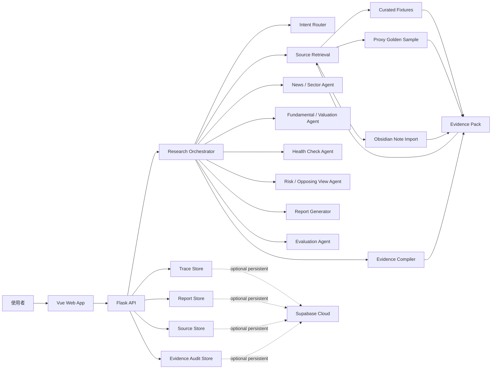
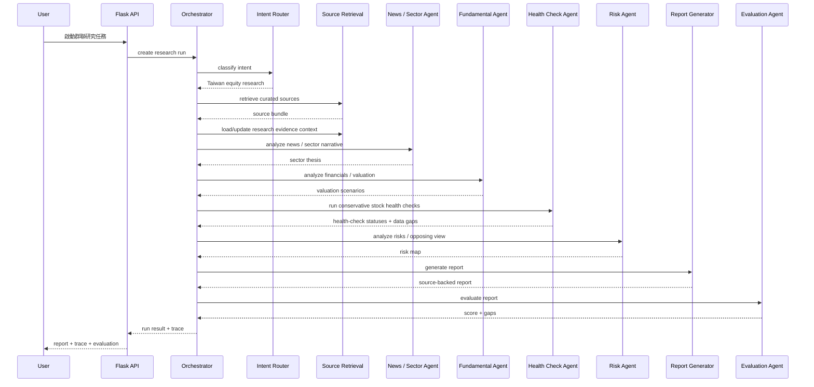

# Design：多代理個人投資 / 理財系統

狀態：草稿 v0.3
對應 SPEC：`SPEC.md`
OpenSpec 變更：`personal-finance-multi-agent-system`

> 這份設計先回答「第一版要怎麼做得出來、看得見、能評估」。它不是最終 implementation plan；確認方向後才進入 `tasks.md`。

## 1. 已決策技術方向

| 面向 | 決策 | 理由 |
|---|---|---|
| 後端 | Flask | Python-first，適合快速串 agent workflow、資料處理、evaluation 與金融資料清洗 |
| 前端 | Vue | 適合做可展示的互動式研究頁、agent trace timeline、source drawer 與 evaluation panel |
| 資料庫 | Supabase Cloud，若第一版需要持久化 | 適合快速建立 Postgres、Auth、Storage 與 API；但不應在第一版過早綁死資料模型 |
| 第一版資料 | 手動 curated fixtures + golden sample + 使用者 Obsidian 筆記 | 降低爬蟲與資料品質風險，先讓 demo 和 evaluation 成立 |
| 第一版資料收集 | 不先自動爬蟲 | Exa API、CMoney/news crawler、MOPS crawler 放到後續版本 |
| 研究證據層 | Evidence Pack Markdown pages | 把 raw sources 轉成可讀、可連結、可追溯、可審計的研究證據 |

### 1.1 已確認第一版 implementation 前提

| 問題 | 決策 |
|---|---|
| Supabase | 第一版先不接，只用本機 fixture / Markdown / JSON；Supabase Cloud 作為後續持久化版本 |
| LLM | 第一版先使用 mock / deterministic agents；等 UI、trace、evaluation 穩定後再接真實 LLM |
| 股價資料 | 第一版用手動 fixture 或使用者輸入展示股價，不接即時行情 API |
| Evidence Pack 深度 | 第一版只做群聯 7 個 evidence pages + provenance + contradiction log，不做完整 knowledge graph |

## 2. 設計原則

1. **先展示可驗證研究流程，不先追求資料自動化**
   - 第一版的價值在於：使用者與面試官能看見 agent 如何取資料、如何形成主張、如何被評估。
   - 資料可以先手動整理，只要來源、日期、類型、限制都完整。

2. **先做 deterministic demo，再接真實 LLM / API**
   - 第一版可以讓部分 agent 先用固定 fixture 產出，確保展示穩定。
   - 真實 LLM 代理可以逐步替換 deterministic agent。

3. **trace 是核心產品，不是除錯附屬品**
   - 網頁不能只顯示最後報告。
   - 每個代理步驟都要顯示輸入摘要、輸出摘要、來源、信心、耗時、成本欄位。

4. **不要把公開來源摘要誤稱為券商研報**
   - CMoney、新聞、FactSet、官方財報要分層。
   - proxy golden sample 必須清楚標示不是完整券商研究報告。

5. **Supabase 是持久化層，不是第一個 blocker**
   - 若要保存研究歷史、trace、evaluation 與來源資料，使用 Supabase。
   - 若只是第一版 demo，可先用本機 JSON / Markdown fixture 讓流程跑通。

6. **Evidence Pack 讓證據累積，而不是每次從零開始 RAG**
   - Raw sources 保持不可變。
   - Evidence pages 由 agent 建議更新，但高風險結論需人工 review。
   - 每個重要 claim 都要能追溯來源、日期與內容版本。

## 3. 系統架構



## 4. 前端設計

### 4.1 第一版頁面

第一版只需要一個主要研究工作台，不做 landing page。

主要區塊：

1. **研究任務列**
   - 預設標的：群聯電子（8299）
   - 預設問題：人工智慧固態硬碟成長故事是否足以支撐目前估值？
   - 啟動研究按鈕

2. **Agent Trace Timeline**
   - 顯示每個代理步驟的狀態：等待、執行中、完成、低信心、失敗。
   - 每個步驟可點開查看摘要與來源。

3. **Source Panel**
   - 顯示來源清單：官方資料、新聞、CMoney、FactSet、Obsidian、golden sample。
   - 每筆來源顯示日期、URL / path、來源類型、可信度限制。

4. **Research Report**
   - 顯示最後產出的研究摘要。
   - 重要主張要能連回來源與 agent step。

5. **Evaluation Panel**
   - 顯示總分、各項 rubric 分數、未通過原因。
   - 若低於 4.0 / 5，標示低信心或需要補資料。

6. **Research Evidence Pack Panel**
   - 顯示目前已整理出的 evidence pages。
   - 顯示 claim provenance、contradiction log、stale claim 提醒。
   - 第一版可以只讀不改，讓使用者看見知識如何被整理。

### 4.2 前端暫定元件

| 元件 | 用途 |
|---|---|
| `ResearchRunView` | 單次研究任務主頁 |
| `ResearchQuestionBar` | 標的與問題輸入 / 預設任務 |
| `AgentTimeline` | 代理執行軌跡 |
| `AgentStepDrawer` | 單一 agent step 詳細資料 |
| `SourceList` | 來源清單與可信度標示 |
| `HealthCheckPanel` | 顯示七種股票健診、狀態、理由、缺口與來源限制 |
| `ReportViewer` | 報告顯示與 claim-source linking |
| `EvaluationPanel` | 分數、rubric、修正建議 |
| `EvidencePageViewer` | 顯示 Evidence Pack 研究頁與 provenance |
| `ContradictionLog` | 顯示矛盾、過期 claim 與待 review 更新 |

## 5. 後端設計

### 5.1 Flask API 邊界

第一版 Flask 後端負責：

- 接收研究問題。
- 啟動研究 orchestrator。
- 回傳 agent trace、來源、報告、evaluation。
- 讀取 curated fixtures、golden sample 與 Obsidian 筆記。
- 若啟用 Supabase，保存研究 run 與 trace。

暫定 API：

| Method | Path | 用途 |
|---|---|---|
| `GET` | `/api/health` | 健康檢查 |
| `GET` | `/api/demo/default-run` | 取得預設群聯 demo run |
| `POST` | `/api/research-runs` | 建立並執行研究任務 |
| `GET` | `/api/research-runs/{run_id}` | 取得單次研究結果 |
| `GET` | `/api/research-runs/{run_id}/steps` | 取得 agent trace |
| `GET` | `/api/research-runs/{run_id}/sources` | 取得來源清單 |
| `GET` | `/api/research-runs/{run_id}/evaluation` | 取得評估結果 |

第一版可以先採同步 API，因為資料量與 demo 流程可控。若要展示「執行中」狀態，再加入 server-sent events 或 polling。

### 5.2 後端模組

| 模組 | 責任 |
|---|---|
| `app.py` / Flask app factory | 啟動 API、設定 CORS、註冊 routes |
| `routes/research_runs.py` | 研究任務 API |
| `orchestrator/research_orchestrator.py` | 控制 agent 執行順序、trace、error handling |
| `agents/intent_router.py` | 判斷是否為台股研究、是否需要完整流程 |
| `agents/source_retrieval.py` | 從 fixture / golden sample / Obsidian 取資料 |
| `agents/news_sector_agent.py` | 整理新聞與產業敘事 |
| `agents/fundamental_agent.py` | 整理財務、EPS、估值情境 |
| `agents/health_check_agent.py` | 將七種股票健診轉成保守、可審計的狀態、理由與資料缺口 |
| `agents/risk_agent.py` | 產生反方觀點與風險 |
| `agents/report_generator.py` | 產生研究報告 |
| `agents/evaluation_agent.py` | 依 rubric 評分 |
| `knowledge/evidence_compiler.py` | 將來源摘要整理成 evidence pages 與更新提案 |
| `knowledge/provenance.py` | 記錄 claim 來源、source hash、stale 狀態 |
| `knowledge/EVIDENCE_PACK.md` | 定義 evidence page 格式、引用規則、矛盾判定與 review gate |
| `stores/file_store.py` | 第一版本機 JSON / Markdown 資料讀寫 |
| `stores/supabase_store.py` | Supabase 持久化，若啟用 |

## 6. Agent Workflow



### 6.1 第二階段最小切片：Health Check Agent

Health Check Agent 是財報狗 benchmark 升級的第一個可執行切片。它的目的不是重做財報狗，也不是猜出付費資料，而是把「七種股票健診」變成可追溯、可顯示、可被 evaluation 檢查的研究框架。

#### 6.1.1 範圍與非範圍

| 類別 | 決策 |
|---|---|
| 第一版資料策略 | 保守缺口型：只使用已整理公開 fixture、source catalog、evidence context 與報告內已有的示範估值資料 |
| 不足資料處理 | 不足以判斷時標 `unknown`；登入、付費、未納入 fixture 或第一版資料入口不存在時標 `not_available` |
| 不允許行為 | 不得用 mock 數字補 pass / fail；不得宣稱讀取財報狗登入或付費頁；不得把 health check 當買賣建議 |
| 本切片輸出 | agent step、`analysis.health_checks`、報告中的股票健診摘要、前端 Health tab、evaluation 檢查 |
| 延後事項 | 自動抓財報狗、Exa / crawler、Supabase 持久化、真實 LLM 推理、完整財報資料庫 |

#### 6.1.2 狀態語意

Health check 狀態必須使用固定 enum，避免 UI、report 與 evaluation 各自解讀。

| Wire value | 中文顯示 | 語意 |
|---|---|---|
| `pass` | 通過 | 現有 fixture 足以支持該健診通過，且有 source IDs 或明確計算依據 |
| `fail` | 未通過 | 現有 fixture 足以支持該健診未通過，且有 source IDs 或明確計算依據 |
| `unknown` | 資料不足 | 有部分線索或理論上可用公開資料補齊，但目前資料不足，不能誠實判定通過或未通過 |
| `not_available` | 目前不可用 | 需要登入、付費、外部資料源、尚未納入 fixture，或第一版不處理 |

`unknown` 和 `not_available` 不可混用。`unknown` 代表可以透過補公開財報、歷史資料或人工整理改善；`not_available` 代表目前產品邊界內沒有資料入口或權限。

#### 6.1.3 Health check fixture schema

第一版應以 `data/phison/health_check_fixture.json` 作為 deterministic input。每筆 check 必須符合以下資料契約：

```json
{
  "id": "growth_stock",
  "name": "成長股健診",
  "status": "unknown",
  "status_reason": "公開來源顯示營收與 Q1 EPS 轉強，但缺近三個月月營收 YoY、毛利、營業利益、稅前與稅後淨利年增的完整序列。",
  "criteria": [
    {
      "id": "monthly_revenue_yoy_3m_positive",
      "label": "月營收 YoY 連續三個月大於 0",
      "status": "unknown",
      "source_ids": ["S1", "S2"],
      "missing_data": ["近三個月月營收 YoY 序列"]
    }
  ],
  "source_ids": ["S1", "S2", "S3"],
  "missing_data": ["近一季毛利年增率", "近一季營業利益年增率"],
  "report_takeaway": "目前只能說成長題材有營收與 EPS 線索，不能完整判定成長股健診通過。",
  "data_policy": "public_fixture_only"
}
```

欄位規則：

- `id` 必須穩定，供測試、UI key、report section 與 evaluation 使用。
- `status` 只能是 `pass`、`fail`、`unknown`、`not_available`。
- `source_ids` 只能引用已存在 source catalog 的 ID；如果沒有可用來源，使用空陣列並在 `missing_data` 說明。
- `criteria` 用來保留財報狗式指標拆解；第一版不要求每個 criteria 都有數字，但必須知道缺什麼。
- `report_takeaway` 是報告可直接引用的保守解讀，不得含買賣指令或保證語氣。
- `data_policy` 第一版固定為 `public_fixture_only`。

#### 6.1.4 七種股票健診的第一版判定

| Check ID | 健診 | 第一版 expected status | 原因與缺口 |
|---|---|---|---|
| `landmine_risk` | 排除地雷股 | `unknown` | 缺近五年自由現金流、營業現金流對淨利比、應收帳款週轉天數、存貨週轉天數 |
| `dividend_income` | 定存股 | `unknown` | 缺近一年殖利率、五年平均殖利率、連續配息、股息發放率 |
| `growth_stock` | 成長股 | `unknown` | 有營收與 Q1 EPS 線索，但缺完整月營收 YoY、毛利、營業利益、稅前與稅後淨利年增序列 |
| `value_stock` | 便宜股 | `unknown` | 有示範 P/E 情境，但缺五年 P/E percentile、P/B、殖利率與市場排名 |
| `chip_signal` | 籌碼 | `not_available` | 分點、大股東、董監持股與股東人數需要額外資料源或登入 / 付費資料 |
| `quality_stock` | 績優股 | `unknown` | 缺上市年限確認、自由現金流報酬率、三年營業利益與估值品質排名 |
| `turnaround_stock` | 轉機股 | `unknown` | 缺 P/B、Piotroski F-score 與低估值排名，且群聯目前 thesis 不是低迷反轉題材 |

第一版不應為了讓 demo 好看而硬產生 `pass`。若某項 check 未來取得足夠資料，才允許改成 `pass` 或 `fail`。

#### 6.1.5 Orchestrator 與 response contract

Health Check Agent 必須在 Fundamental Agent 之後、Risk Agent 之前執行，因為它會使用營收、EPS、估值與資料缺口來補充風險判讀。

完整 run response 應新增：

```json
{
  "analysis": {
    "health_checks": {
      "summary": {
        "total": 7,
        "pass": 0,
        "fail": 0,
        "unknown": 6,
        "not_available": 1,
        "data_policy": "public_fixture_only",
        "major_gaps": ["現金流", "股利", "籌碼", "長期估值區間"]
      },
      "checks": []
    }
  }
}
```

Agent step 的 `output_summary` 必須包含檢核總數與缺口概況，例如：「完成 7 種股票健診框架，0 pass、0 fail、6 unknown、1 not_available；主要缺口為現金流、股利、籌碼與長期估值區間。」

#### 6.1.6 Report integration

Report Generator 必須新增「股票健診摘要」段落，至少包含：

- 七種健診的狀態表。
- 每項的保守 takeaway。
- 主要缺口清單。
- 明確註記：這不是財報狗登入 / 付費資料結果，而是本機公開 fixture 的保守框架化輸出。

報告不得：

- 把 `unknown` 寫成「通過」或「偏多」。
- 把 `not_available` 寫成「尚可」或「資料良好」。
- 因為 health check 缺資料就跳過該段落；缺資料本身就是輸出的一部分。

#### 6.1.7 Frontend integration

前端應在既有 detail panel 新增 `Health` tab：

- 顯示七個 health check cards 或 rows。
- 每項顯示狀態 chip、reason、missing data、source IDs。
- `unknown` 和 `not_available` 要視覺上和 `pass` / `fail` 明顯不同，避免使用者誤會。
- 在 summary band 可顯示 health-check gap summary，例如 `Health gaps: 6 unknown / 1 N/A`。
- mobile viewport 下不得因 criteria 或 missing data 文字過長而溢出。

#### 6.1.8 Evaluation integration

Evaluation Agent 必須新增 health-check 完整性與資料誠實度檢查：

- 若報告缺少「股票健診摘要」，應降分或標 `needs_revision`。
- 若七種健診沒有全部出現，應降分。
- 若報告把 `unknown` 或 `not_available` 包裝成通過、買進理由或完整資料，應觸發 hard fail。
- 若報告宣稱使用財報狗付費 / 登入資料，但 fixture 沒有該來源，應觸發 hard fail。
- 若 health check 明確列出缺口與補資料方向，應提高 user usefulness 與 risk coverage 的評分理由。

### 6.2 第二階段最小切片：Fundamental Agent 擴充

Fundamental Agent 擴充是 Health Check Agent 之後的下一個切片。現有 Fundamental Agent 主要做 EPS 情境與 Forward P/E，容易讓使用者以為「有估值」就等於「完整基本面」。擴充後的 Fundamental Agent 必須把營收、獲利能力、安全性、成長力與現金流品質拆開，並清楚標示哪些資料已取得、哪些只是 partial evidence、哪些仍缺資料。

#### 6.2.1 範圍與非範圍

| 類別 | 決策 |
|---|---|
| 第一版資料策略 | 仍使用本機 public fixture，不接財報狗登入 / 付費資料、不接 MOPS crawler、不接 Supabase |
| 核心目標 | 將基本面從單一 EPS / P/E 情境擴充成五大面向的 financial snapshot |
| 仍保留 | 既有 `valuation_scenarios` 必須保留，避免破壞 report、tests 與 UI |
| 新增輸出 | `analysis.fundamentals.summary`、`analysis.fundamentals.categories`、`analysis.fundamentals.key_findings`、`analysis.fundamentals.data_gaps` |
| 不允許行為 | 不得用不存在的完整財報數字填空；不得把新聞轉述當成 audited financial statement；不得把單季 EPS 年化當成正式全年預估 |
| 延後事項 | 自動抓公開資訊觀測站、完整三表歷史資料、同業排名、正式 margin / cash-flow database |

#### 6.2.2 Metric coverage status

Fundamental metrics 必須使用固定 coverage status，而不是用自然語言自由描述：

| Wire value | 中文顯示 | 語意 |
|---|---|---|
| `available` | 已取得 | fixture 有足夠資料可呈現該 metric，且有 source IDs |
| `partial` | 部分取得 | 有方向性線索或單期資料，但不足以完成趨勢、同比、品質或完整判讀 |
| `missing` | 缺資料 | 理論上可由公開財報或人工整理補齊，但目前 fixture 沒有 |
| `not_available` | 目前不可用 | 需要付費、登入、外部資料源，或第一版產品邊界外 |

此 status 和 Health Check 的 `pass / fail / unknown / not_available` 不同：Fundamental Agent 評估的是「資料覆蓋程度與財務解讀」，不是健診是否通過。

#### 6.2.3 Fundamental fixture schema

下一步實作應新增 `data/phison/fundamental_metrics_fixture.json`。建議 schema：

```json
{
  "as_of_date": "2026-05-10",
  "data_policy": "public_fixture_only",
  "categories": [
    {
      "id": "revenue",
      "name": "營收",
      "coverage_status": "partial",
      "category_takeaway": "已取得 2026 年 4 月營收與新聞轉述的月增 / 年增線索，但尚未建立完整近 12 個月序列。",
      "metrics": [
        {
          "id": "monthly_revenue_latest",
          "label": "最新月營收",
          "period": "2026-04",
          "value": 202.07,
          "unit": "TWD_BN",
          "coverage_status": "available",
          "source_ids": ["S1", "S2"],
          "interpretation": "4 月營收可作為 AI SSD / NAND 循環敘事的營收端線索。",
          "missing_data": []
        }
      ],
      "missing_data": ["近 12 個月營收序列", "累計營收 YoY"]
    }
  ]
}
```

欄位規則：

- `categories` 必須剛好覆蓋五大面向：`revenue`、`profitability`、`safety`、`growth`、`cash_flow_quality`。
- 每個 category 必須有 `coverage_status`、`category_takeaway`、`metrics`、`missing_data`。
- 每個 metric 必須有 `id`、`label`、`period`、`value`、`unit`、`coverage_status`、`source_ids`、`interpretation`、`missing_data`。
- 若數值未知，`value` 可為 `null`，但 `coverage_status` 必須是 `partial`、`missing` 或 `not_available`，且 `missing_data` 不可為空。
- `source_ids` 只能引用 source catalog 中已存在的 ID。
- `unit` 必須使用穩定值，例如 `TWD_BN`、`TWD`、`percent`、`days`、`ratio`、`text`、`not_applicable`。

#### 6.2.4 五大面向的第一版資料覆蓋

| Category ID | 面向 | 第一版 expected coverage | 必要 metrics / gaps |
|---|---|---|---|
| `revenue` | 營收 | `partial` | 可用 S1 / S2 呈現 2026-04 月營收與新聞線索；缺近 12 個月序列、累計營收 YoY、產品別營收 |
| `profitability` | 獲利能力 | `partial` | 可用 S3 呈現 Q1 EPS；缺毛利率、營業利益率、淨利率、ROE / ROA |
| `safety` | 安全性 | `missing` | 缺負債比、流動比、速動比、利息保障倍數與金融借款 |
| `growth` | 成長力 | `partial` | 可用 S1 / S2 / S3 提供營收與 EPS 成長線索；缺完整月營收 YoY 序列、毛利 / 營業利益 / 淨利成長率 |
| `cash_flow_quality` | 現金流品質 | `missing` | 缺營業現金流、自由現金流、OCF / net income、存貨與應收帳款週轉 |

第一版可以讓 `revenue`、`profitability`、`growth` 呈現 partial evidence，但 `safety` 與 `cash_flow_quality` 應保守標為 `missing`，除非新增正式來源。

#### 6.2.5 Fundamental Agent output contract

擴充後的 `analysis.fundamentals` 應保留現有 `valuation_scenarios`，並新增：

```json
{
  "analysis": {
    "fundamentals": {
      "valuation_scenarios": [],
      "summary": {
        "categories_total": 5,
        "available": 0,
        "partial": 3,
        "missing": 2,
        "not_available": 0,
        "data_policy": "public_fixture_only",
        "major_gaps": ["毛利率", "現金流", "負債比", "週轉天數"]
      },
      "categories": [],
      "key_findings": [
        "營收與 EPS 有正向線索，但現金流與資產負債表尚未納入。"
      ],
      "data_gaps": []
    }
  }
}
```

Agent step 的 `output_summary` 不應只說「建立 EPS 情境」，而應說明五大面向的覆蓋度，例如：「建立 EPS/P/E 情境並整理五大基本面面向：3 partial、2 missing；主要缺口為毛利率、現金流、負債比與週轉天數。」

#### 6.2.6 Health Check dependency

Health Check Agent 應可讀取擴充後的 fundamentals payload：

- `growth_stock` 可引用 `fundamentals.categories.growth` 的 partial evidence。
- `landmine_risk` 可引用 `cash_flow_quality` 的 missing gaps。
- `value_stock` 仍以 Valuation Agent 未完成為資料缺口，不應把 Forward P/E 情境當完整便宜股判定。
- Health Check 不應直接重新計算 fundamental metrics；它只消費 Fundamental Agent 的輸出與 fixture。

#### 6.2.7 Report integration

Report Generator 必須新增或擴充「基本面拆解」段落，至少包含：

- 五大面向的 coverage table。
- 每個面向的 takeaway。
- 已有資料與缺口分開列出。
- 將 EPS / Forward P/E 情境明確標示為估值敏感度，不等同完整基本面品質。

報告不得：

- 因為 Q1 EPS 強就宣稱獲利能力全面改善。
- 因為營收強就宣稱現金流品質改善。
- 因為 Forward P/E 看起來較低就宣稱公司便宜。
- 把缺資料的 `safety` 或 `cash_flow_quality` 寫成已確認健康。

#### 6.2.8 Frontend integration

前端應新增或擴充 `Fundamentals` view：

- 可在 detail panel 新增 `Fundamentals` tab，或在既有 report 旁新增 compact panel。
- 顯示五大 categories、coverage status、主要 metrics、source IDs、missing data。
- `partial` / `missing` 必須視覺上和 `available` 不同。
- 不應把 valuation scenarios 和 fundamentals categories 混成同一張表；兩者可在同一 tab 但要分區。

#### 6.2.9 Evaluation integration

Evaluation Agent 必須新增 fundamental coverage 檢查：

- 若 report 缺少五大面向的基本面拆解，應降分或標 `needs_revision`。
- 若 report 把 partial / missing metric 寫成已確認，應 hard fail。
- 若 report 使用 EPS 年化卻沒有說明限制，應 hard fail 或至少重大扣分。
- 若 report 清楚列出營收、獲利、安全性、成長力、現金流品質與缺口，應提高 valuation rigor、risk coverage、user usefulness。

## 7. Evidence Pack 研究證據層

Evidence Pack 是本專案的研究證據層。它不是取代 RAG，也不是完整 knowledge graph；它把已整理來源轉成可讀、可連結、可審計的 Markdown pages，讓 agent 不必每次從 raw documents 重新拼答案。

### 7.1 三層設計

| 層級 | 本專案對應 | 是否可修改 | 用途 |
|---|---|---|---|
| Raw sources | 新聞、財報、CMoney、FactSet、官方資料、Obsidian 筆記 | 不可直接修改 | 保留原始依據與來源 hash |
| Research Evidence Pack | 群聯公司頁、AI SSD 頁、NAND 週期頁、估值假設頁、風險頁、券商觀點頁 | 可由 agent 提議更新 | 累積可讀研究知識 |
| Evidence schema | `knowledge/EVIDENCE_PACK.md` | 人工維護 | 約束頁面格式、citation、provenance、矛盾與 review 規則 |

### 7.2 第一版 Evidence 頁面

第一版先針對群聯建立最小頁面集：

| Page | 目的 |
|---|---|
| `Company_Phison_8299.md` | 公司定位、產品線、投資問題 |
| `Theme_AI_SSD.md` | AI SSD / enterprise SSD 成長敘事 |
| `Cycle_NAND.md` | NAND 供需與價格循環 |
| `Valuation_EPS_Assumptions.md` | FactSet、CMoney、券商摘要與 EPS 情境 |
| `Risk_Register.md` | NAND 反轉、庫存、現金流、估值敏感度 |
| `Brokerage_View_Summary.md` | 公開來源可確認的券商 / 法人觀點 |
| `Contradiction_Log.md` | 數字或敘事矛盾、過期 claim、待 review 項目 |

### 7.3 Claim provenance

每個重要 claim 應記錄：

```json
{
  "claim_id": "claim_eps_factset_2026_avg",
  "page": "Valuation_EPS_Assumptions.md",
  "claim": "FactSet 2026 EPS 平均預估為 192.4 元",
  "source_ids": ["S5"],
  "source_hashes": ["sha256:..."],
  "as_of_date": "2026-05-04",
  "reliability": "consensus_estimate_via_news",
  "status": "active"
}
```

### 7.4 更新流程

1. 新來源進入 `data/phison/sources/`。
2. Source Retrieval 計算 source hash 並建立 source record。
3. Evidence Compiler 判斷影響哪些 evidence pages。
4. Evidence Compiler 產生更新提案，不直接覆蓋高風險頁面。
5. 若新資料和既有 claim 矛盾，寫入 `Contradiction_Log.md`。
6. 人工 review 後，更新正式 evidence page。
7. Research Orchestrator 從 evidence + raw sources 取 context，再交給各 agent。

### 7.5 審計與展示價值

這層對課程展示很有價值，因為它讓系統不是「問一次答一次」：

- 可以展示知識如何隨新新聞和財報累積。
- 可以展示同一個 EPS 或目標價 claim 是從哪個來源來的。
- 可以展示 CMoney / 新聞摘要和正式財報的可信度不同。
- 可以展示當新資料推翻舊資料時，系統會記錄矛盾，而不是默默覆寫。

## 8. Trace 資料模型

第一版只保存摘要與來源，不保存完整 chain-of-thought 或冗長中間輸出。

### 8.1 Research Run

```json
{
  "id": "run_20260510_phison_ai_ssd",
  "target": {
    "ticker": "8299",
    "name": "群聯電子",
    "market": "TW_OTC"
  },
  "question": "人工智慧固態硬碟成長故事是否足以支撐目前估值？",
  "status": "completed",
  "created_at": "2026-05-10T10:00:00+08:00",
  "completed_at": "2026-05-10T10:00:30+08:00",
  "evaluation_score": 4.2
}
```

### 8.2 Agent Step

```json
{
  "id": "step_fundamental",
  "run_id": "run_20260510_phison_ai_ssd",
  "agent": "fundamental_agent",
  "status": "completed",
  "input_summary": "使用來源 S1-S5，檢查營收、EPS、FactSet 共識與券商摘要",
  "output_summary": "2026 EPS 假設分散程度高，估值支撐取決於採用 FactSet 中位數或群益高標",
  "source_ids": ["S1", "S3", "S4", "S5"],
  "confidence": 0.78,
  "latency_ms": 3200,
  "cost_usd": null
}
```

### 8.3 Source Reference

```json
{
  "id": "S5",
  "title": "FactSet 最新調查：群聯 2026 EPS 中位數 184.73 元",
  "source": "鉅亨",
  "source_type": "consensus_estimate",
  "date": "2026-05-04",
  "url": "https://m.cnyes.com/news/id/6441530",
  "reliability_note": "FactSet consensus via news platform; not a full brokerage report"
}
```

### 8.4 Evaluation Result

```json
{
  "run_id": "run_20260510_phison_ai_ssd",
  "total_score": 4.2,
  "threshold": 4.0,
  "dimensions": [
    {"name": "source_grounding", "score": 4.5},
    {"name": "valuation_rigor", "score": 4.0},
    {"name": "industry_narrative", "score": 4.0},
    {"name": "risk_coverage", "score": 4.0},
    {"name": "user_usefulness", "score": 4.5}
  ],
  "notes": [
    "有標示 CMoney / 新聞摘要不是正式券商研報",
    "仍需補正式 Q1 財報與現金流資料"
  ]
}
```

## 9. 資料層設計

### 9.1 第一版本機資料

第一版可以先使用：

| 資料 | 建議位置 | 格式 |
|---|---|---|
| proxy golden sample | `golden_samples/群聯_8299_公開來源券商新聞彙整_golden_sample.md` | Markdown |
| source catalog | `data/phison/source_catalog.json` | JSON |
| curated source excerpts | `data/phison/sources/*.md` | Markdown |
| demo run fixture | `data/phison/demo_run.json` | JSON |
| evaluation rubric | `data/evaluation/rubric.json` | JSON |
| research evidence pages | `knowledge/phison/pages/*.md` | Markdown |
| evidence schema | `knowledge/EVIDENCE_PACK.md` | Markdown |
| evidence provenance | `knowledge/phison/provenance.json` | JSON |
| contradiction log | `knowledge/phison/Contradiction_Log.md` | Markdown |

這樣可以讓 Flask API 在沒有 Supabase 的情況下先跑出完整 demo。

### 9.2 Supabase 資料表草案

若第一版需要保存研究歷史，使用 Supabase Cloud。暫定表如下：

| Table | 用途 |
|---|---|
| `research_runs` | 一次研究任務 |
| `agent_steps` | 每個 agent 的執行摘要 |
| `sources` | 手動整理或自動收集的來源 |
| `run_sources` | run 與 source 的關聯 |
| `reports` | 產生的研究報告 |
| `evaluations` | 評估結果與 rubric 分數 |
| `claims` | 報告中的重要主張與來源連結 |
| `evidence_pages` | Evidence Pack 頁面 |
| `evidence_claims` | Evidence 內的重要 claim 與 provenance |
| `source_hashes` | 來源 hash 與 stale 檢查 |
| `contradictions` | 矛盾與待 review 項目 |
| `evidence_change_reviews` | 人工 review 紀錄 |

第一版若不需要登入，可以先不啟用 Supabase Auth。若之後要保存個人研究歷史，再加入使用者表與 row-level security。

## 10. Evaluation 設計

第一版採 rubric-based evaluation，proxy golden sample 作為人工與半自動比對基準。

評估流程：

1. Report Generator 產生研究報告。
2. Evaluation Agent 讀取 rubric 與 proxy golden sample。
3. 逐項檢查來源、估值、產業、風險與使用者可用性。
4. 若總分低於 4.0 / 5，標示低信心並列出需要補強的資料。
5. 若出現反幻覺清單中的重大錯誤，直接判定不通過或要求重寫。
6. 檢查重要主張是否已有 evidence provenance；若 claim 沒有來源或來源過期，扣分。

第一版不需要追求完全自動化評分；可以讓 Evaluation Agent 產生可檢查的評分理由。

## 11. 已決策與延後事項

以下為第一版 implementation 的已決策邊界與延後事項：

1. **LLM provider**
   - 第一版使用 mock / deterministic agents。
   - 後續保留 provider adapter，再接 OpenAI API 或其他模型。

2. **是否第一版就接 Supabase**
   - 第一版不接 Supabase，只用本機 fixture 跑通。
   - 若 demo 需要保存多次 runs 或多人使用，再接 Supabase。

3. **前後端專案結構**
   - 建議：monorepo，`backend/` 放 Flask，`frontend/` 放 Vue。
   - 優點：課程 project 展示與部署比較清楚。

4. **資料更新策略**
   - 建議：第一版手動更新 `data/phison/`。
   - 後續再加 Exa API / crawler。

5. **股價資料**
   - 第一版不接即時行情 API。
   - 使用者輸入展示股價，或從手動 fixture 讀取「示範股價 + 日期」。

6. **報告輸出形式**
   - 建議：第一版網頁顯示 + 可下載 Markdown。
   - 後續可加 PDF 或 Obsidian export。

7. **Evidence Pack 的第一版深度**
   - 第一版只做群聯 7 個 evidence pages + provenance + contradiction log。
   - 暫不做完整 typed entity system；等資料超過 100 頁再考慮 BM25 / vector / SQLite / Supabase 搜尋升級。

## 12. 建議的下一步

下一步是依照 `tasks.md` 進入實作。第一個實作里程碑應先完成本機資料 fixture、Evidence Pack 頁面與 deterministic backend pipeline，然後再做 Vue 展示介面。
